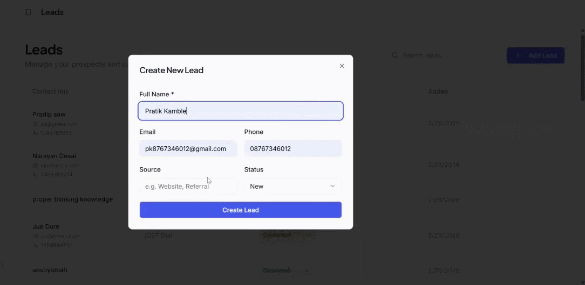

<h1 align="center">🚀 Lead Flow CRM</h1>

<p align="center">
A modern MERN stack CRM to manage leads, track customer interactions, and automate outreach.
</p>

## 🎥 Application Demo

<p align="center">
  
</p>

## ✨ Features

| Feature | Description |
|--------|-------------|
| 📊 Dashboard | Visual overview of leads and activities |
| 👥 Lead Management | Add, edit, and manage customer leads |
| 📧 AI Email Generator | Generate outreach emails automatically |
| 🔐 Authentication | Secure login and user sessions |
| 📱 Responsive UI | Works on desktop and mobile |

# 🛠 Tech Stack

Frontend

* React.js
* Tailwind CSS
* Vite

Backend

* Node.js
* Express.js

Database

* MongoDB

## 🌐 Live Demo

<p align="center">
<a href="https://your-live-demo-link.com">

</a>
</p>


## 🖼 Project Screenshots

<p align="center">
  
  
</p>

<p align="center">
  
</p>

## ⚙ Installation Guide

Follow these steps to run the project locally.

### 1️⃣ Clone the repository

```bash
git clone https://github.com/Pratikkamble123/Lead-Flow-CRM.git
cd Lead-Flow-CRM
```

### 2️⃣ Install dependencies

```bash
npm install
```

### 3️⃣ Setup environment variables

Create a `.env` file inside the server folder.

Example:

```env
PORT=5000
MONGO_URI=your_mongodb_connection_string
JWT_SECRET=your_secret_key
```

### 4️⃣ Run the application

Backend

```bash
npm run server
```

Frontend

```bash
npm run dev
```

# 🧠 Project Architecture

Frontend (React + Vite)

→ API Requests

Backend (Node.js + Express)

→ Database Operations

MongoDB Database

Architecture Flow:

User → React Frontend → Express API → MongoDB → Response → Frontend UI


# 📂 Project Structure

client/
server/
shared/
attached_assets/
package.json


# 👨‍💻 Author

Pratik Kamble
Computer Science & Design Student
YCCE Nagpur

GitHub
https://github.com/Pratikkamble123

---

# ⭐ Support

If you like this project, please give it a ⭐ on GitHub.
